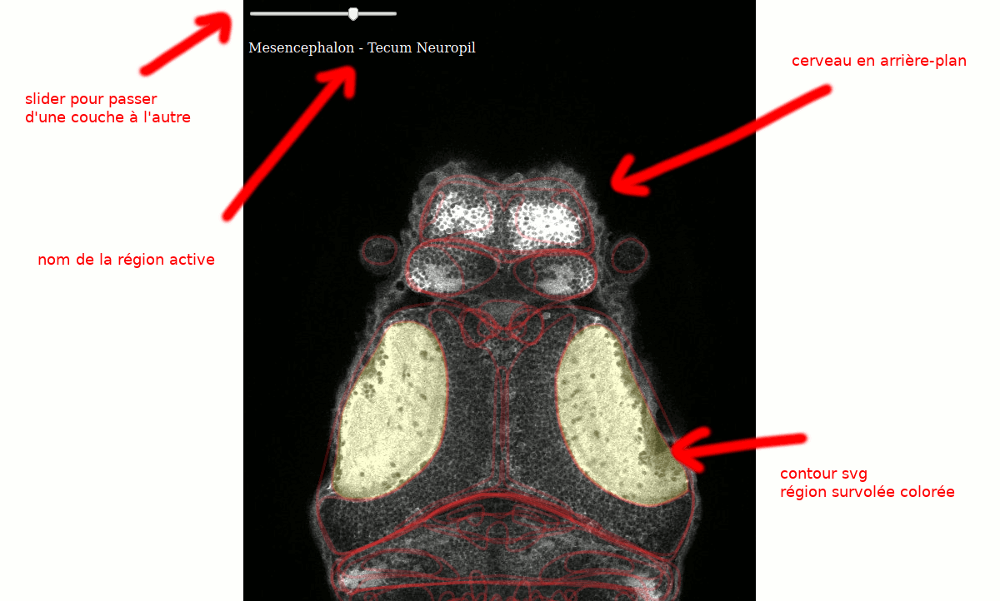

# Zebrain contour

This collection of scripts produce an interactive svg-based web page showing contours of zbrain regions.

Requirements:
- bash
- MATLAB
- ImageJ
- potrace (`sudo apt install potrace`)
- python3
- a web browser (tested with Firefox)

Clone the repo and run the scripts inside it.

## Scripts

1. **download.sh** download `MaskDatabase.mat` (120Mo) and `Ref20131120pt14pl2.nrrd` (230Mo) from [Z-Brain Atlas](https://engertlab.fas.harvard.edu/Z-Brain/)
2. **export_zebrain.m** with _matlab_ export masks as PNG and correspondence table
3. **export.ijm** with _imagej_ export layers as JPEG
4. **vectorize.sh** with _potrace_ (inkscape) vectorize to svg
5. **extract.py** with _python_ combine and tag svgs
6. **combine.py** with _python_ combine all svgs in one file
7. **region-names.py** with _python_ convert region names to json
8. **serve.sh** with _python_ serve the files and open the browser

## TODO
- set colors according to hierarchy
- be size-agnostic (allow resize of base image)
- put svg small regions above larger ones
- allow loading html as a single file (include json in file)
- migrate MATLAB to octave and automate this part
- automate ImageJ part
