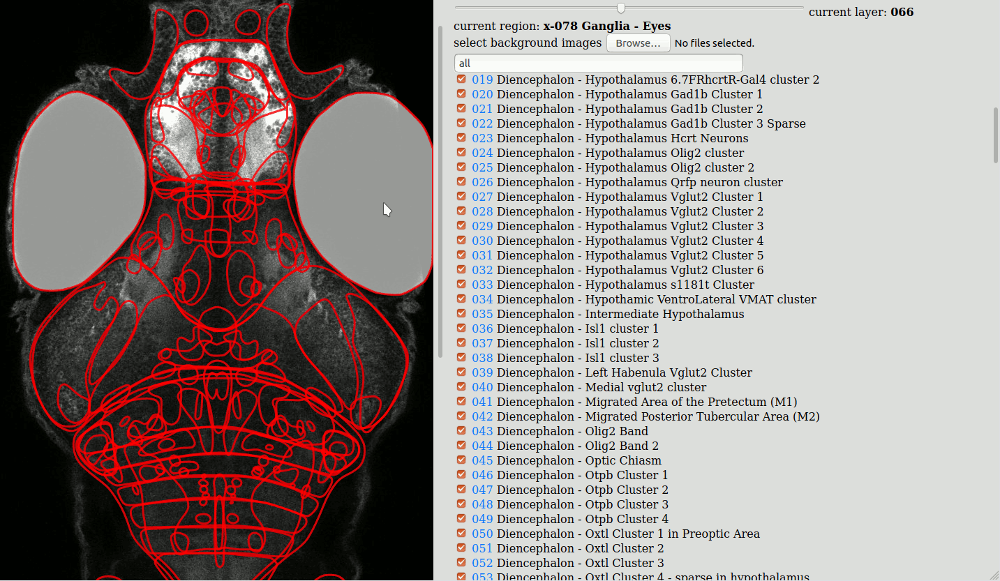

# Zebrain contour

This collection of scripts produce an interactive svg-based web page showing contours of zbrain regions.

## Interface usage

Use the slider to scroll between layers. Hover your mouse over a contour to display it's area. Click to print its name. In the text area, enter a list of space-separated integers corresponding to regions. Also allows keywords like "all", "none" and "vestibular" to display a pre-defined set of regions.

## Script usage

Requires:
- bash
- MATLAB
- ImageJ
- potrace (`sudo apt install potrace`)
- python3
- a web browser (tested with Firefox and Chromium)

Clone the repo and run the scripts inside it as follows.

1. **download.sh** download `MaskDatabase.mat` (120Mo) and `Ref20131120pt14pl2.nrrd` (230Mo) from [Z-Brain Atlas](https://engertlab.fas.harvard.edu/Z-Brain/)
2. **export_zebrain.m** with _matlab_ export masks as PNG and correspondence table
3. **export.ijm** with _imagej_ export layers as JPEG
4. **vectorize.sh** with _potrace_ (inkscape) vectorize to svg
5. **extract.py** with _python_ combine and tag svgs
6. **combine.py** with _python_ combine all svgs in one file
7. **region-names.py** with _python_ convert region names to json
8. **serve.sh** with _python_ serve the files and open the browser

## Bug or feature request

Please [file an issue](https://github.com/LJPZebra/zebrain/issues/new) to report a bug or request a feature.